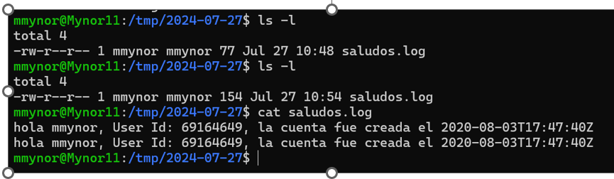

## UNIVERSIDAD SAN CARLOS DE GUATEMALA ##
## FACULTAD DE INGENIERIA ##
## ESCUELA DE CIENCIAS Y SISTEMAS ##
## Sistemas operativos 1##
## SECCIÓN A ##

### Actividad 1 ###

- **Nombre:** Mynor Francisco Morán García   **Carne:** 201603232

>>


<div id='content'/>

## Contenido

1. [CÓDIGO en BASH](#id1)
-  [CONFIGURACIÓN DEL CRON](#id2)
-  [RESULTADO](#id3)


<div id='id1'/>

- **CÓDIGO EN BASH**[ ⇧](#content)

```sh

#!/bin/bash

GITHUB_USER=$1

if [ -z "$GITHUB_USER" ]; then
   echo "Por favor, proporcione un nombre de usuario Github"
   exit 1

fi

RESPONSE=$(curl -s "https://api.github.com/users/$GITHUB_USER")


if [ -z "$RESPONSE" ]; then
   echo "No se recibió respuesta de la API de github"
   exit 1

fi


FECHA=$(date +%Y-%m-%d)

DIRECTORIO="/tmp/$FECHA"
mkdir -p "$DIRECTORIO"

LOG_FILE="$DIRECTORIO/saludos.log"

echo "$LOG_FILE \n"

USER_ID=$(echo $RESPONSE | jq -r .id)
CREATED_AT=$(echo $RESPONSE | jq -r '.created_at')


echo "hola $GITHUB_USER, User Id: $USER_ID, la cuenta fue creada el $CREATED_AT" | tee -a "$LOG_FILE"
    

```


<div id='id2'/>

- **CONFIGURACIÓN DEL CRON**[ ⇧](#content)

```sh

*/5 * * * * /home/usuario/scripts/miscript.sh    

```

<div id='id3'/>

- **RESULTADO**[ ⇧](#content)



