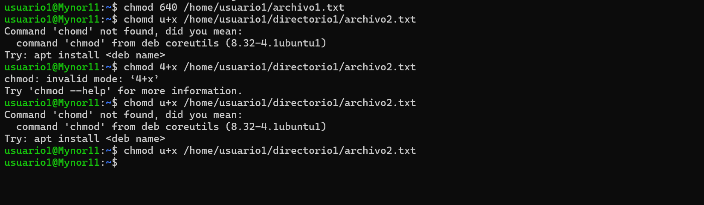

## UNIVERSIDAD SAN CARLOS DE GUATEMALA ##
## FACULTAD DE INGENIERIA ##
## ESCUELA DE CIENCIAS Y SISTEMAS ##
## Sistemas operativos 1##
## SECCIÓN A ##

### Actividad 1 ###

- **Nombre:** Mynor Francisco Morán García   **Carne:** 201603232

>>

## Contenido

1. [PARTE 1](#id1)
-  [PARTE 2](#id2)
-  [PARTE 3](#id3)

- **Parte 1: Gestión de Usuarios**[ ⇧](#content)

1. Creación de Usuarios: Crea tres usuarios llamados `usuario1`, `usuario2` y `usuario3`.

2. Asignación de Contraseñas: Establece una nueva contraseñas para cada usuario creado.

3. Información de Usuarios: Muestra la información de `usuario1` usando el comando `id`.

4. Eliminación de Usuarios: Elimina `usuario3`, pero conserva su directorio principal.

  

- **Parte 2: Gestión de Grupos**[ ⇧](#content)

1. Creación de Grupos: Crea dos grupos llamados `grupo1` y `grupo2`.

2. Agregar Usuarios a Grupos: Agrega `usuario1` a `grupo1` y `usuario2` a `grupo2`.

3. Verificar Membresía: Verifica que los usuarios han sido agregados a los grupos utilizando el comando `groups`.

4. Eliminar Grupo: Elimina `grupo2`.

- **Parte 3: Gestión de Permisos**[ ⇧](#content)

1. Creación de Archivos y Directorios:

- Como `usuario1`, crea un archivo llamado `archivo1.txt` en su directorio principal y escribe algo en él.
- Crea un directorio llamado `directorio1` y dentro de ese directorio, un archivo llamado `archivo2.txt`.

2. Verificar Permisos: Verifica los permisos del archivo y directorio usando el comando `ls -l` y `ls -ld` respectivamente.

3. Modificar Permisos usando `chmod` con Modo Numérico: Cambia los permisos del `archivo1.txt` para que sólo `usuario1` pueda leer y escribir (permisos `rw-`), el grupo pueda leer (permisos `r--`) y nadie más pueda hacer nada.

4. Modificar Permisos usando `chmod` con Modo Simbólico: Agrega permiso de ejecución al propietario del `archivo2.txt`.

5. Cambiar el Grupo Propietario: Cambia el grupo propietario de `archivo2.txt` a `grupo1`.

6. Configurar Permisos de Directorio: Cambia los permisos del `directorio1` para que sólo el propietario pueda entrar (permisos `rwx`), el grupo pueda listar contenidos pero no entrar (permisos `r--`), y otros no puedan hacer nada.

7. Comprobación de Acceso: Intenta acceder al `archivo1.txt` y `directorio1/archivo2.txt` como `usuario2`. Nota cómo el permiso de directorio afecta el acceso a los archivos dentro de él.

8. Verificación Final: Verifica los permisos y propietario de los archivos y directorio nuevamente con `ls -l` y `ls -ld`.

