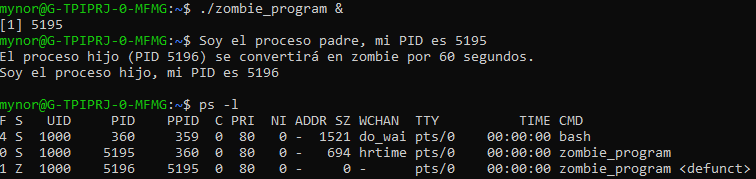

**Pregunta1:** ¿Incluyendo el proceso inicial, cuantos procesos son creados por el siguiente programa?
<b>Respuesta: 8</b>

## Análisis de los procesos creados

El programa realiza tres llamadas consecutivas a la función `fork()`, la cual crea un proceso hijo que es una copia del proceso que la llama. A continuación, se explica cuántos procesos se crean en cada llamada:

1. **Primera llamada a `fork()`**:
   - Se crean **2** procesos en total: el proceso original (padre) y un nuevo proceso hijo.
   
2. **Segunda llamada a `fork()`**:
   - Ambos procesos (padre e hijo creados en la primera llamada) ejecutan otra llamada a `fork()`, creando **4** procesos en total (cada uno de los dos anteriores crea un nuevo hijo).
   
3. **Tercera llamada a `fork()`**:
   - Los cuatro procesos existentes ejecutan la tercera llamada a `fork()`, lo que genera un total de **8** procesos.
  
### Respuesta final

En total, incluyendo el proceso inicial, el programa crea **8 procesos**.

### Explicación matemática

Cada llamada a `fork()` duplica el número de procesos existentes, por lo tanto, después de 3 llamadas, hay \( 2^3 = 8 \) procesos en total.

**Pregunta2:** Utilizando un sistema Linux, escriba un programa en C que cree un proceso hijo (fork) que finalmente se convierta en un proceso zombie. Este proceso zombie debe permanecer en el sistema durante al menos 60 segundos.

```c
#include <stdio.h>
#include <stdlib.h>
#include <sys/types.h>
#include <unistd.h>
#include <sys/wait.h>
#include <time.h>

int main() {
    pid_t pid = fork();  // Crear proceso hijo

    if (pid < 0) {
        // Error al crear el proceso
        perror("fork failed");
        exit(1);
    } else if (pid == 0) {
        // Código del proceso hijo
        printf("Soy el proceso hijo, mi PID es %d\n", getpid());
        exit(0);  // El proceso hijo termina, convirtiéndose en zombie
    } else {
        // Código del proceso padre
        printf("Soy el proceso padre, mi PID es %d\n", getpid());
        printf("El proceso hijo (PID %d) se convertirá en zombie por 60 segundos.\n", pid);
        
        // Esperar 60 segundos para que el proceso hijo esté en estado zombie
        sleep(60);

        // Luego de 60 segundos, el proceso padre llama a wait() para eliminar el zombie
        wait(NULL);  // Recolecta el proceso hijo, eliminando el zombie
        printf("Proceso zombie (PID %d) ha sido eliminado.\n", pid);
    }

    return 0;
}
```
### Resultado



**Pregunta3:** Usando el siguiente código como referencia, completar el programa para que sea ejecutable y responder las siguientes preguntas:
• ¿Cuántos procesos únicos son creados? Respuesta: 1
• ¿Cuántos hilos únicos son creados? Respuesta: 4
```c
pid_t pid;

pid = fork()
if (pid == 0){
    fork();
    tread_create(...);
 }
fork();
```
CODIGO DE RESPUESTA
```c
#include <stdio.h>
#include <unistd.h>
#include <pthread.h>
#include <sys/types.h>
#include <sys/wait.h>

// Función que será ejecutada por el hilo
void* thread_function(void* arg) {
    printf("Hilo ejecutado\n");
    return NULL;
}

int main() {
    pid_t pid;
    pthread_t thread;

    pid = fork(); // Primer fork

    if (pid == 0) {
        // En el proceso hijo
        fork(); // Segundo fork

        // Crear un hilo en el proceso hijo
        pthread_create(&thread, NULL, thread_function, NULL);
        pthread_join(thread, NULL);
    }

    fork(); // Tercer fork

    // Esperar a que los procesos hijos terminen
    while (wait(NULL) > 0);

    return 0;
}
```
